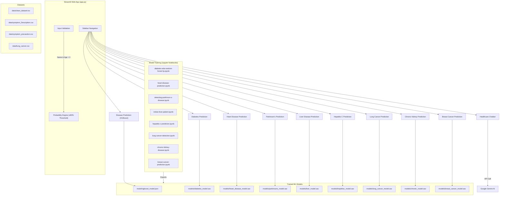

# Machine Learning and AI in Cancer Prognosis Prediction and Treatment Selection


A comprehensive machine learning-powered web application that predicts the risk of **9 different diseases** including cancer, diabetes, heart disease, and more. Built with Streamlit and powered by multiple trained ML models, this project provides **confidence-based predictions** with an 80% threshold to assist healthcare professionals and patients in early disease detection.

## 📋 Table of Contents
- [About the Project](#-about-the-project)
- [Problem Statement](#-problem-statement)
- [How It Works](#-how-it-works)
- [Architecture](#-architecture)
- [Features](#-features)
- [Installation](#-installation)
- [Configuration](#-configuration)
- [Usage](#-usage)
- [Model Information](#-model-information)
- [Technologies Used](#-technologies-used)
- [License](#-license)
- [Contact](#-contact)

## 📖 About the Project

This project leverages machine learning algorithms to analyze clinical data and predict the likelihood of multiple diseases. It serves as a decision-support tool that can assist healthcare professionals in early diagnosis and treatment planning.

### Key Highlights

- **Multi-Disease Platform:** A single application that covers 9 different diseases, from general symptom-based prediction to specific conditions like breast cancer and chronic kidney disease.
- **Confidence-Based Predictions:** Instead of simple yes/no answers, the system provides a **prediction confidence percentage**, making results more transparent and clinically useful.
- **80% Threshold Logic:** A prediction is only flagged as "Positive" when the model's confidence is **≥ 80%**, reducing false positives and improving reliability.
- **Input Validation:** Built-in safeguards ensure users provide meaningful clinical data (name, age, etc.) before running predictions, preventing misleading results from empty or default inputs.
- **AI-Powered Chatbot:** An integrated healthcare chatbot powered by Google Gemini AI allows users to ask general health-related questions directly within the app.

## 🎯 Problem Statement

Early detection of diseases like cancer, diabetes, and heart disease significantly improves patient outcomes. However, access to specialized diagnostic tools is often limited, and clinical data interpretation requires expert knowledge.

This project addresses these challenges by:
1. **Democratizing Disease Screening:** Providing an accessible web-based tool that anyone can use for preliminary health assessments.
2. **Leveraging ML for Pattern Recognition:** Using trained machine learning models to identify disease risk patterns from clinical data that may not be immediately apparent to the human eye.
3. **Providing Transparent Results:** Going beyond binary predictions to show confidence percentages, helping users and healthcare providers understand the certainty of each prediction.

> **⚠️ Disclaimer:** This tool is designed for **educational and research purposes only**. It is not a substitute for professional medical diagnosis. Always consult qualified healthcare professionals for medical advice.

## 🔄 How It Works

1. **User Input:** The patient enters their clinical data (e.g., blood pressure, glucose levels, age) through the Streamlit web interface.
2. **Input Validation:** The system validates that essential fields (Name, Age) are filled before processing.
3. **Model Prediction:** The data is passed to the corresponding pre-trained ML model, which calculates the probability of the disease using `predict_proba()` or `decision_function()` (for SVM models).
4. **Confidence Assessment:** The positive-class probability is extracted and displayed as a percentage (e.g., "Prediction Confidence: 85.3%").
5. **Threshold Decision:** If the confidence is **≥ 80%**, the result is flagged as **Positive**; otherwise, it is reported as **Negative**.
6. **Result Display:** The prediction result, confidence percentage, and corresponding visual feedback are shown on the same page.

## 🏗️ Architecture



### Directory Structure

```
├── app.py                  # Main Streamlit application (~1000 lines)
├── code/
│   ├── DiseaseModel.py     # XGBoost disease prediction class
│   ├── helper.py           # Symptom array preparation utility
│   └── train.py            # XGBoost model training script
├── models/                 # 8 serialized ML model files (.sav)
├── model/                  # XGBoost model JSON for symptom-based prediction
├── data/                   # Runtime CSVs (symptoms, descriptions, precautions)
├── Backend/Datasets/
│   ├── Datasets/           # 10 training datasets (CSV)
│   └── Model Training/     # 8 Jupyter training notebooks
├── Photo/                  # UI images for disease pages
├── requirements.txt
└── .env                    # Google Gemini API key
```

## ✨ Features

- **9 Disease Predictions:** General disease (symptom-based), Diabetes, Heart Disease, Parkinson's, Liver Disease, Hepatitis C, Lung Cancer, Chronic Kidney Disease, Breast Cancer.
- **Probability-Based Results:** Shows prediction confidence as a percentage and uses an **80% threshold** — only flags as Positive when confidence ≥ 80%.
- **Input Validation:** Requires Name and Age (where applicable) before allowing predictions, preventing misleading results from empty inputs.
- **Healthcare Chatbot:** AI-powered chatbot using Google Gemini for health-related queries.
- **Data Visualization:** Interactive charts and plots using Plotly, Matplotlib, and Seaborn.
- **Disease Info & Precautions:** Displays disease descriptions and precautions for the general disease prediction module.

## ⚙️ Installation

1.  **Clone the repository:**
    ```sh
    git clone https://github.com/Mayurdoiphode55/Machine-Learning-and-AI-in-Cancer-Prognosis-Prediction-and-Treatment-Selection.git
    cd Machine-Learning-and-AI-in-Cancer-Prognosis-Prediction-and-Treatment-Selection
    ```

2.  **Create and activate a virtual environment (recommended):**
    ```sh
    python -m venv venv
    venv\Scripts\activate        # On Windows
    # source venv/bin/activate   # On macOS/Linux
    ```

3.  **Install the required dependencies:**
    ```sh
    pip install -r requirements.txt
    ```

## 🔑 Configuration

To use the Healthcare Chatbot, you need a Google AI API key.

1.  **Get your API Key** from [Google AI Studio](https://aistudio.google.com/app/apikey).
2.  **Create a `.env` file** in the root directory of the project.
3.  **Add your API key** to the `.env` file:
    ```
    API_KEY="YOUR_API_KEY_HERE"
    ```

## 🚀 Usage

```sh
streamlit run app.py
```

1. Select a disease prediction page from the **sidebar**.
2. Enter your **name**, **age**, and other clinical values.
3. Click the **predict button** to see:
   - **Prediction Confidence** (percentage)
   - **Positive/Negative** result (based on ≥80% threshold)
4. Use the **Healthcare Chatbot** for general health queries.

## 🧠 Model Information

| Disease | Model Type | Trained Via |
|---------|-----------|-------------|
| General Disease | XGBoost | `code/train.py` |
| Diabetes | SVC | Jupyter Notebook |
| Heart Disease | Scikit-learn | Jupyter Notebook |
| Parkinson's | Scikit-learn | Jupyter Notebook |
| Liver Disease | Scikit-learn | Jupyter Notebook |
| Hepatitis C | Scikit-learn | Jupyter Notebook |
| Lung Cancer | Scikit-learn | Jupyter Notebook |
| Chronic Kidney | Scikit-learn | Jupyter Notebook |
| Breast Cancer | Scikit-learn | Jupyter Notebook |

All models use the `get_positive_probability()` helper function which supports `predict_proba()`, `decision_function()` (for SVC), or binary `predict()` as fallback.

## 🛠️ Technologies Used

- **Programming Language:** Python 3.x
- **Web Framework:** Streamlit
- **ML Libraries:** Scikit-learn, XGBoost
- **Data Processing:** Pandas, NumPy
- **Visualization:** Plotly, Matplotlib, Seaborn
- **AI Chatbot:** Google Generative AI (Gemini)
- **Other:** Joblib, Pillow, python-dotenv
- **Tools:** Jupyter Notebook, Git & GitHub

## 📄 License

This project is licensed under the MIT License - see the `LICENSE` file for details.

## 📧 Contact

Mayur Doiphode

Project Link: [https://github.com/Mayurdoiphode55/Machine-Learning-and-AI-in-Cancer-Prognosis-Prediction-and-Treatment-Selection](https://github.com/Mayurdoiphode55/Machine-Learning-and-AI-in-Cancer-Prognosis-Prediction-and-Treatment-Selection)
